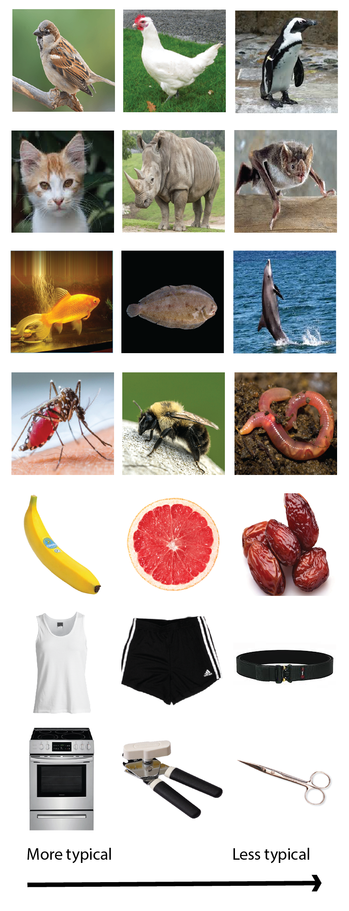
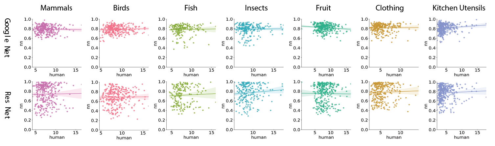
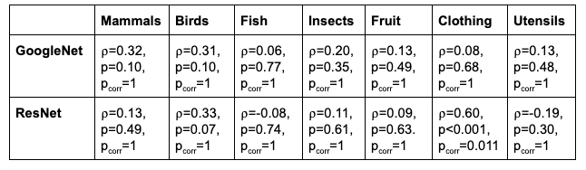
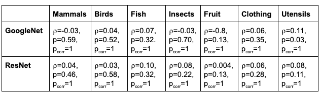

# Neural network representations of within-category variance 
## Introduction 
Moment to moment we are faced with an incoming flurry of complex information. However, we are able to effortlessly handle this onslaught of information by relying on our rich, highly structured conceptual system. Concepts are mental representations of the commonalities shared amongst a set of individuals belonging to the same category. Relationships between concepts are systematic and hierarchically-structured. This structure provides a powerful mechanism by which people are able to efficiently incorporate new information into preexisting knowledge and make appropriate generalizations across individuals both within and between categories. 
 
 
Given the importance of this structure, how is it formed and sculpted with experience? Some have pointed to the role of early cognitive biases heavily guiding the process (Gelman & Medin, 1993) while others have suggested that this structure could entirely be a reflection of the statistical regularities experienced within the world (Lake et al. 2015; Saffran et al. 1996). Recent work using deep neural networks has provided insight into this question, replicating complex human behavior in categorization tasks without built-in explicit structure (Lake et al., 2015; Peterson et al., 2016; Saxe, 2018). This suggests that internalizing the environment’s structure via the detection of statistical regularities may be sufficient in building these complex conceptual structures. One aspect of the environment that may be particularly informative in building these structures is the experienced within-category coherence and variability. Some have suggested that sensitivity to within-category details may be crucial to the detection of statistical regularities across variable exemplars and to cueing the formation of a new category (Griffiths et al.,2007; Love et al., 2004; Rhodes & Gelman, 2008; Rhodes & Brickman, 2010). If this is the case, could representations of  category variability be partially responsible for neural networks’ human-like performance on categorization tasks? At first glance, this seems unlikely because the neural network is being trained to classify exemplars into certain categories, thus, the focus of attention will be on detection of between category differences as opposed to within-category details. However, Lake at al. (2015) were able to replicate human typicality ratings. Typicality ratings reflect the variability of individual exemplars within a category around a central prototype. The ability of the network to replicate human typicality ratings suggests that there is some prototype-like representation encoded in the network along with variation around that prototype. 
 
 
The current work seeks to replicate and extend the work of Lake et al. (2015).They compare the performance of 3 different deep convolutional neural network architectures (OverFeat, AlexNet, GoogLeNet) in replicating human typicality judgements. Here, we consider the ResNet architecture along with AlexNet, and GoogLeNet. Along with using the outputs of these networks to compare to human typicality ratings, we also extract feature representations of exemplars to see if the networks can replicate similarity ratings between exemplars. 
  
## Methods

Human typicality and similarity ratings from 7 different categories were obtained from the Leuven Concept Database (De Deyne et al. 2008). 3 architectures were tested on their ability to predict these ratings. 

<em> <strong>Figure 1.</strong> A sample of images of exemplars input into the networks for typicality and similarity ratings. A range is shown from the most typical to the least typical exemplars as identified by human participants. </em>

	
**Human behavioral data**  
From 112 undergraduates at the University of Leuven, typicality ratings and similarity ratings of 5-33 exemplars were obtained from 7 categories: birds, clothing, fish, fruit, insects, utensils, and mammals. Importantly, this dataset includes categories of both artifacts and natural kinds. There is evidence to suggest that artifacts and natural kinds may be represented in fundamentally different ways (e.g., Diesendruck & Gelman, 1999; Estes, 2003; Keil, 1989; Malt & Johnson, 1992). 

*Typicality Ratings*
Participants were given a list of exemplars with the category label printed at the top of the list. They were asked to indicate how typical, on a scale of 1 (very atypical) to 20 (very typical), each item was of the category printed at the top of the page.

*Similarity Ratings*
Pairwise similarity ratings were collected for all exemplar combinations within each category. Participants were asked to judge the similarity of every pair on a scale of 1 (totally dissimilar) to 20 (totally similar). 

**Convolutional Networks**  
We used three different architectures: AlexNet, GoogleNet, and ResNet18. AlexNet and GoogleNet were both found to provide good replication of human typicality judgements in Lake et al. (2015). ResNet18 was also included because of its superior classification performance over AlexNet and GoogleNet. All network’s were pre-trained on ImageNet. Pre-trained covnets classify inputs into 1 of 1000 categories. These categories are finer-grained than the ones available in the Leuven Concepts database, so the models were fine-tuned to categorize inputs into 1 of the 7 categories specified above. Images for fine-tuning were obtained by taking superclasses within the Imagenet database of the categories used in the Leuven Concepts database. 

Images used for typicality and similarity judgements were acquired by the following process. For each exemplar in the dataset an image was chosen via Google search. Images were chosen such that there was a single animal or object in clear view. To obtain an exemplar’s typicality rating, its image was fed into the network and the correct label’s probability was taken as the rating. A Spearman rank correlation was performed on the network’s typicality ratings and the average human typicality ratings. 

 To obtain pairwise within-category exemplar ratings, each exemplar’s feature embedding was extracted from the network and the cosine similarity between the feature embeddings was taken. Feature embeddings from AlexNet and GoogleNet were extracted from the final max pooling layers. Feature embeddings from ResNet18 were extracted from the average pooling layer. A Spearman rank correlation was performed on the network’s cosine similarity between exemplars and the average human pairwise exemplar similarity ratings.  
 
 ## Results
 
 

	<em> <strong>Figure 2.</strong> For each network and each category, the network's typicality ratings are plotted against the average human subject typicality ratings. The line is surrounded by a 95% CI. </em>

	

	<em> <strong>Figure 3.</strong> For each network and each category, the network's similarity ratings for each pairing of exemplars are plotted against the average human subject similarity ratings. The line is surrounded by a 95% CI. </em>

 
Results from AlexNet are not displayed here. The fine-tuning procedure did not produce a reduction in loss with more training epochs, thus AlexNet had very poor classification performance. With poor classification performance, it is difficult to interpret its typicality and similarity ratings. 

Across categories, relationships between network typicality ratings and human subject typicality ratings were primarily non-existent after applying Bonferroni correction for multiple comparisons(Figure 2; Table 1). Because performance was so poor in either model and across categories, it’s unclear which model had better overall performance and which categories models excelled at. One thing to note, however, ResNet excelled within the Clothing category (⍴=0.60, p=0.01), reaching performance on par with that found in Lake et al. (2015). 

Both models also performed poorly in replicating human similarity judgements (Table 2; Figure 3). This is not surprising given the poor performance in replicating typicality ratings. However, interestingly, ResNet appeared to produce a greater variation in similarity judgments than GoogleNet (Figure 3). GoogleNet’s judgements are heavily clustered on the high end (0.7 - 0.9) and have a limited range (0.4 - 1) while ResNet’s judgements are more diffuse and span a greater range (0.2 - 1). 

<em> <strong>Table 1 - Correlations of Typicality Ratings.</strong> Spearman rank correlations between network generated typicality ratings and human subject typicality ratings within each category. P-values before and after Bonferroni correction for multiple comparisons are given. 
</em>

	<em> <strong>Table 2 - Correlations of Similarity Ratings.</strong> Spearman rank correlations between network generated pairwise exemplar similarity ratings and human subject similarity ratings within each category. Bonferroni correction for multiple comparisons. P-values before and after Bonferroni corrected for multiple comparisons are given. 
</em>

## Discussion
Performance of the networks on these category datasets was substantially worse than those in Lake et al. (2015). This may be because the categories used for typicality ratings were substantially different from Lake et al. (2015).  They used much narrower categories (banana, bathtub, coffee mug, envelope, pillow, soap dispenser, table lamp, and teapot) that are less conceptually rich than animal categories. With broader, richer categories, this allows for a larger set of possible features that could be used to calculate typicality and similarity between exemplars. Potentially, the set of features that humans and covnets used were non-overlapping leading to differences in judgements. The networks rely on purely perceptual features while humans may use more abstract, non-perceptual features such as taxonomic information to make typicality and similarity judgements. To allow for better performance, potentially an exemplar’s image and some properties (e.g. can fly, is big) would need to be given to the model. Saxe (2018) was able to capture a hierarchical conceptual structure remarkably similar to that of humans by feeding the network both perceptual and non-perceptual properties. Also, perhaps, more likely, a longer fine-tuning  period may have been necessary in order for the network to appropriately learn to classify examples into the superclasses. 
 
 
Both GoogleNet and ResNet performed poorly in replicating human similarity judgments. However, ResNet produced a much greater range of similarity judgements while GoogleNet’s judgements were tightly clustered on the higher of similarity judgements. This is suggestive of ResNet representing within-category variation in more detail than GoogleNet. In the training the network to correctly classify examples , within-category variation information is lost as representations of exemplars between categories are pulled apart from one another and representations of exemplars within categories are pulled towards each other. However, potentially, ResNet does better at retaining some of these within-category distinctions. These within-category details may aid in greater efficiency in new concept acquisition, and ultimately, a swifter transition to a more useful, hierarchically-structured conceptual system. However, it is important to note that the variation over features it retains may be different than the variation humans represent in their conceptual structures. 
 
 
While the results from this project were lackluster, they do point to the importance of multiple types of information in the acquisition of conceptual knowledge and suggest that some networks are able to represent within-category variation. Our concepts do not consist of purely perceptual information (e.g. koalas are grey), but also include abstract knowledge that we learn from others or from experimentation/study (e.g. koalas are marsupials who eat Eucalyptus). Neural networks have proved to be promising test beds for learning how humans may acquire and use conceptual knowledge. However,making better inferences from neural networks’ conceptual structures to humans’ will require providing input that is more similar to that which is provided to humans. Once the input networks receive is richer, the networks’ conceptual structure may become more humanlike which may allow us to gain important insight into which features variation is represented over within categories, and why a representation of variation may be important for building useful conceptual structures. 

## References 
Gelman, S.A., & Medin, D.L. (1993). What's so essential about essentialism? A different perspective on the interaction of perception, language, and concrete knowledge. Cognitive Development, 8, 113-139. 
 
 
Lake, B. M., Zaremba, W., Fergus, R. & Gureckis, T. M. (2015b) Deep neural networks predict category typicality ratings for images. In: Proceedings of the 37th Annual Meeting of the Cognitive Science Society, Pasadena, CA, July 22–25, 2015. Cognitive Science Society. 
 
 
Love B.C., Medin D.L., Gureckis T.M. (2004). SUSTAIN: a network model of category learning. Psychol. Rev. 111:309–32.
Saffran J.R., Newport  E.L. , Aslin R.N. (1996) Word segmentation: the role of distributional cues. Journal of Memory and Language, 35, pp. 606-621.
 
 
Rhodes, M., & Gelman, S.A. (2008). Categories influence predictions about individual consistency. Child Development, 79: 1271-1288.
 
 
Rhodes, M., & Brickman, D. (2010). The role of within-category variability in category-based induction: A developmental study. Cognitive Science, 34: 1561-1573.
 
 
Peterson, J. C., Abbott, J. T. & Griffiths, T. L. (2016) Adapting deep network features to capture psychological representations. In: Proceedings of the 38th Annual Conference of the Cognitive Science Society, pp. 2363–68. 
 
 
Saxe A, McClelland, J.L., & Ganguli, S. (2018a). A mathematical theory of semantic development in deep neural networks. arXiv preprint arXiv:1810.10531, 2018a.
 
 
Griffiths,T., Canini,K., Sanborn,A., & Navarro,D.(2007).Unifying rational models of categorization via the hierarchical Dirichlet process.  In: Proceedings of the 38th Annual Conference of the Cognitive Science Society (pp.323–328).
 
 
De Deyne, S., Verheyen, S., Ameel, E., Vanpaemel, W., Dry, M., Voorspoels, W., & Storms G. (2008). Exemplar by feature applicability matrices and other Dutch normative data for semantic concepts. Behavior Research Methods, 40 (4), 1030-1048. 
 

